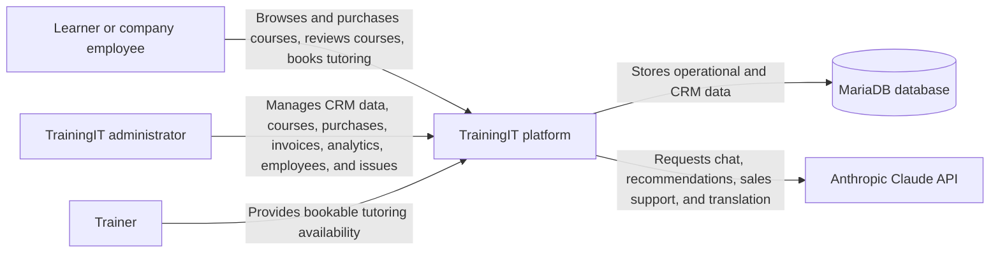
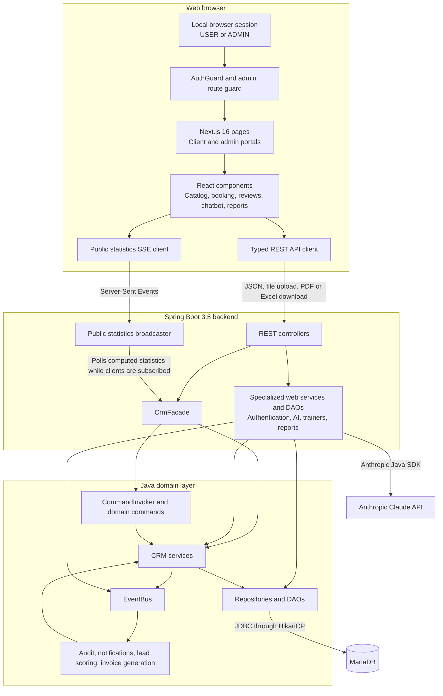
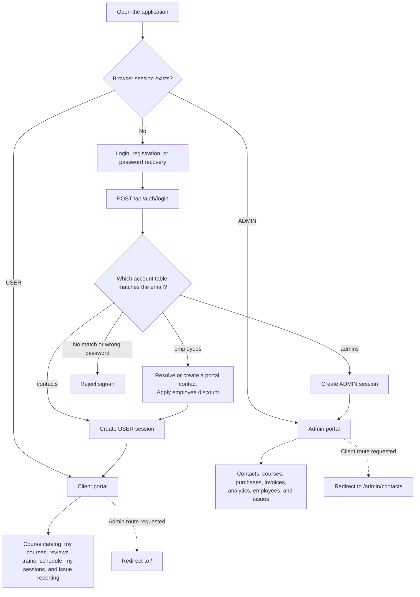
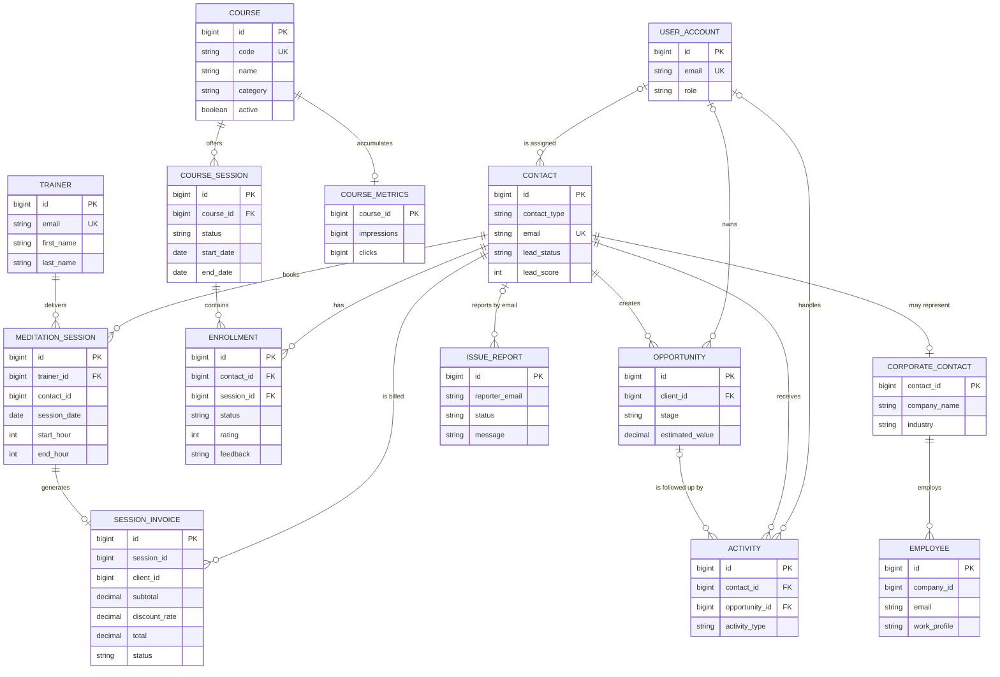
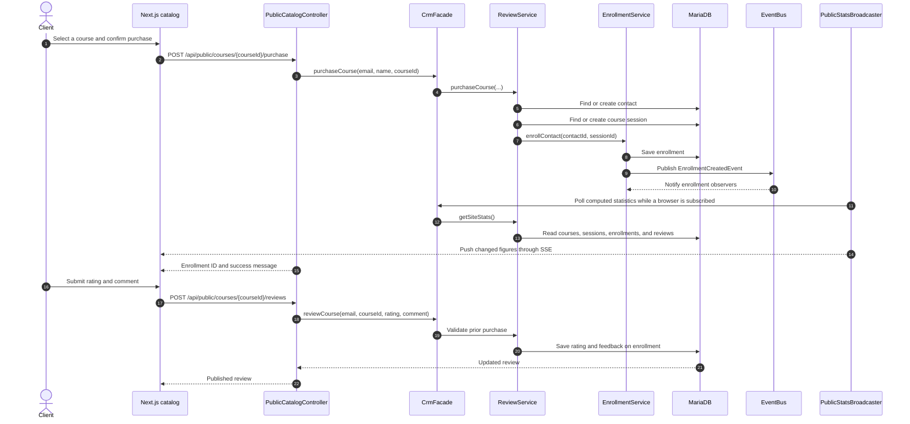
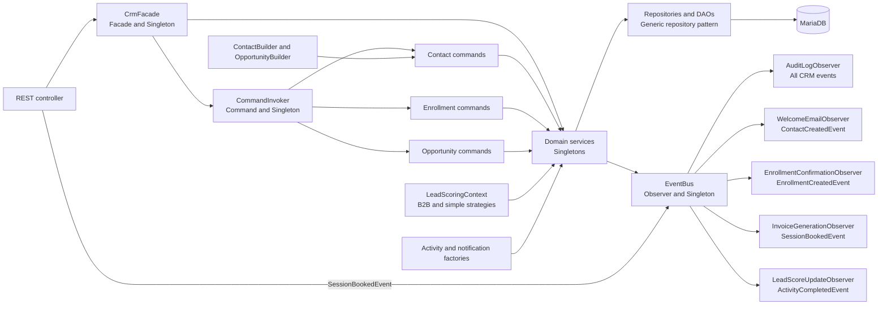

# TrainingIT Application Diagrams

These diagrams describe the current TrainingIT implementation: a Next.js client portal and admin portal, a Spring Boot REST API, a pattern-based Java domain layer, and a MariaDB database.

## 1. System context



## 2. Application architecture



## 3. Role-based navigation



## 4. Core data model

This is a conceptual view of both the CRM tables and the web-feature tables created at application startup. It intentionally omits most scalar fields.



## 5. Course purchase and review flow



## 6. Trainer booking and automatic invoice flow

```mermaid
sequenceDiagram
    autonumber
    actor Client
    participant UI as Schedule page
    participant Trainers as TrainerController
    participant Sessions as MeditationSessionDao
    participant Events as EventBus
    participant Observer as InvoiceGenerationObserver
    participant Invoice as InvoiceService
    participant Employees as EmployeeDao
    participant Invoices as InvoiceRepository

    Client->>UI: Choose trainer and date range
    UI->>Trainers: GET /api/trainers/{id}/availability
    Trainers->>Sessions: Load existing bookings
    Sessions-->>Trainers: Booked intervals
    Trainers-->>UI: Working days and free intervals

    Client->>UI: Choose start time and duration
    UI->>Trainers: POST /api/trainers/{id}/sessions
    Trainers->>Sessions: Revalidate account, hours, date, and overlap
    Sessions-->>Trainers: Validation result
    Trainers->>Sessions: Save tutoring session
    Trainers->>Events: Publish SessionBookedEvent
    Events->>Observer: Notify observer
    Observer->>Invoice: generateForSession(session)
    Invoice->>Invoices: Check for an existing invoice
    Invoice->>Employees: Check employee email
    Employees-->>Invoice: 60% discount or no discount
    Invoice->>Invoices: Save paid invoice
    Trainers-->>UI: Booking confirmation

    Note over Invoice,Invoices: Invoice creation is idempotent; observer failure is logged without rolling back the booking.
```

## 7. Domain patterns and event reactions


